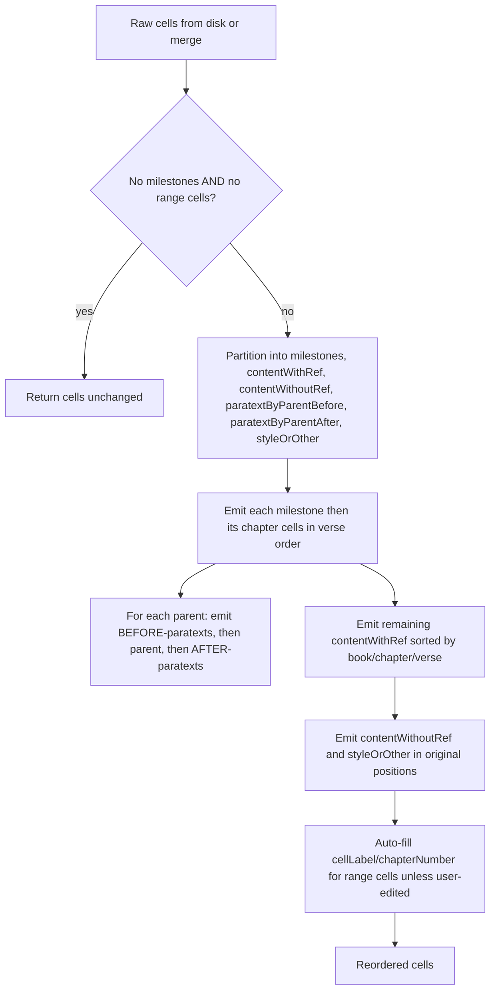

## Goals

- Issue 1: paratext that originally sat between a milestone and the first verse (e.g. the chapter heading "ဖန်ဆင်းခြင်း" with `parentId: 98c7b6a3-…` in your sample) must stay there. Only paratext that was actually disconnected from its parent should move.
- Issue 2: the cell ordering produced by `migration_verseRangeLabelsAndPositions` (and the verse-range `cellLabel` it sets) must survive git sync, regardless of which side of the merge the local file is on.

## Root causes

- Paratext placement: in [`migrateVerseRangeLabelsAndPositionsForFile`](src/projectManager/utils/migrationUtils.ts) lines 3037–3048 every paratext gets bucketed by `parentId` and `emitContentCell` always emits the bucket _after_ the parent ([3212–3217](src/projectManager/utils/migrationUtils.ts)). There is no "before-parent" bucket, so chapter-heading paratexts placed between a milestone and the first verse are forced to after the parent verse.
- Sync overwrite: `resolveCodexCustomMerge` in [src/projectManager/utils/merge/resolvers.ts](src/projectManager/utils/merge/resolvers.ts) walks `ourCells` first and preserves their order (lines 1220–1244), and `applyEditToCell` only knows about `value`, `cellLabel`, `selectedAudioId`, `selectionTimestamp`, `isLocked`, `startTime`, `endTime`, `deleted`, and a generic `data.*` setter ([927–984](src/projectManager/utils/merge/resolvers.ts)). Cell _order_ is not part of edit history, and the migration writes `cellLabel`/`chapterNumber` directly without an `EditHistory` entry, so once any peer's local file is in the unmigrated order during a merge the structural fix is silently dropped.

## Approach



### 1. Extract a pure reorder/relabel function

Create `reorderVerseRangeCells(cells)` (in a new helper file co-located with the migration, e.g. `src/projectManager/utils/merge/utils/verseRangeReorder.ts` so both the migration and the merge resolver can import it without a circular dep on `migrationUtils.ts`). Signature roughly:

```typescript
export interface VerseRangeReorderResult {
    cells: any[];
    /** True if any metadata field was changed (cellLabel/chapterNumber autofill, suffix-stripped refs). */
    mutated: boolean;
    /** True if cell order changed. */
    orderChanged: boolean;
}

export function reorderVerseRangeCells(cells: any[]): VerseRangeReorderResult;
```

Behavior:

- **Early exit (no-op for non-scripture files):** Walk the input once. If there are no milestones AND no cells with `parsed.kind === "range"`, return `{ cells, mutated: false, orderChanged: false }` immediately. This keeps the helper inert on notes/glossary `.codex` files and on any file the migration is not trying to fix.
- Partition cells like the current migration does, but build TWO paratext buckets per parent based on each paratext's original index relative to its parent's original index:
    - `paratextBeforeParent: Map<parentId, cell[]>` for paratexts whose original index is `< parentIndex`.
    - `paratextAfterParent: Map<parentId, cell[]>` for those `> parentIndex`.
    - Paratexts whose `parentId` is not present in the cells array are NOT touched here (no soft-delete, no relocation). They flow through as if they were `styleOrOther` and keep their original index. The migration handles orphan soft-delete itself (see §2 below) so this helper has zero mutating side-effects when called from the resolver.
- Strip `:1` suffixes from `globalReferences` (existing logic). This is metadata-level cleanup of a malformed value, idempotent, and still safe to do on every merge.
- Emit logic: push `paratextBeforeParent.get(parentId)` BEFORE pushing the parent cell, then push the parent, then push `paratextAfterParent.get(parentId)`.
- Auto-fill `cellLabel` and `chapterNumber` on verse-range cells from the parsed ref **only when the user hasn't already set a value**. Concretely: skip the autofill on a cell if `metadata.edits` contains any entry whose `editMap.join(".") === "metadata.cellLabel"` and `type !== EditType.MIGRATION` — i.e. there is a non-migration edit explicitly setting `cellLabel`. Otherwise set it (and add no edit). This preserves intent for human relabels while keeping the auto-derive idempotent across merges.
- Cells in `contentWithoutRef` and `styleOrOther` keep their original positions in the final output as much as possible (they fall through after the milestone-chapter blocks).
- The helper does NOT add edit-history entries. It only sets `cellLabel`, `chapterNumber`, and a cleaned `globalReferences[0]`.

### 2. Use the helper from the migration

In [`migrateVerseRangeLabelsAndPositionsForFile`](src/projectManager/utils/migrationUtils.ts) (lines 2999–3275):

- Keep the existing merge phase that combines split children into the parent, soft-deletes children, and tracks `mergedChildIds`. These add edits and need to keep doing so.
- **Orphan paratext soft-delete stays in the migration** (not in the helper). After the merge phase but before calling the helper, walk the cells once: for any paratext whose `parentId` does not match an existing cell id, if `data.deleted !== true` set it and append a single MIGRATION `EditHistory` entry with `editMap: EditMapUtils.dataDeleted()`. Idempotent: never adds an edit if already deleted. Soft-delete edits propagate to peers through the existing edit-history replay in `resolveMetadataConflictsUsingEditHistory`.
- After the merge phase and orphan soft-delete, replace the manual partition+emit code with a call to `reorderVerseRangeCells(cells)` and use its `cells`/`mutated`/`orderChanged` plus the merge/orphan flags to decide whether to write the file.
- Drop the existing single-bucket `paratextByParentId` since the helper handles ordering.

### 3. Apply the helper inside the merge resolver

In `resolveCodexCustomMerge` ([src/projectManager/utils/merge/resolvers.ts](src/projectManager/utils/merge/resolvers.ts)), right before the final `formatJsonForNotebookFile` ([1287–1293](src/projectManager/utils/merge/resolvers.ts)):

```typescript
const reordered = reorderVerseRangeCells(resultCells);
resultCells.length = 0;
resultCells.push(...reordered.cells);
```

This guarantees that whether the merge ran on user A's machine or user B's machine, the final file is always in correct verse-range order with correct `cellLabel`/`chapterNumber`. The helper:

- Bails out as a no-op on files with no milestones and no range cells, so non-scripture notebooks are untouched.
- Adds no edit-history entries, so repeated merges do not bloat edit history.
- Does not soft-delete any cells in the resolver path (orphan handling stays in the migration).
- Does not overwrite a `cellLabel` that has been hand-edited by a user.

The merge phase (combining child→parent, soft-deleting merged children, tracking `mergedChildIds`) and the orphan paratext soft-delete stay in the migration only — those edits already propagate through the resolver's existing edit-history replay.

### 4. Tests

Add cases to [src/test/suite/migration_verseRangeLabelsAndPositions.test.ts](src/test/suite/migration_verseRangeLabelsAndPositions.test.ts):

- Paratext immediately after a milestone (and before any verse cell) stays between the milestone and the first verse.
- Paratext immediately after its parent stays after the parent.
- Multiple paratexts before a parent retain their relative order before the parent.
- Orphan paratext (parentId not in cells): stays in its original position AND gets `data.deleted = true` with a single MIGRATION edit; running the migration again does not add a second edit.
- A verse-range cell with a user-edited `cellLabel` (a non-MIGRATION edit on `metadata.cellLabel`) is NOT overwritten by the helper, even on repeated migration runs.
- Regression test for `mergedChildIds` accumulation: run the migration, simulate a merge against an unmigrated peer (round-trip through `resolveCodexCustomMerge`), then run the migration again — assert no new `mergedChildIds` edit is appended on the second run and the parent's value/cellLabel/order are stable.

Add focused tests for the merge resolver in [src/test/suite/resolveCodexCustomMerge.test.ts](src/test/suite/resolveCodexCustomMerge.test.ts) (or a new file) that:

- Build `ourContent` with cells in the unmigrated order and `theirContent` with the same cells in migrated order. Assert the merged output is in migrated order (verse-sorted under the milestone) with correct verse-range `cellLabel`, regardless of which side is "ours".
- Build both sides already migrated and assert the merge is stable (no change in order, no extra edits added by the resolver).
- Provide a notebook with no milestones and no range cells; assert the resolver output is byte-stable (the helper's early-exit no-op path).
- Provide a notebook containing an orphan paratext; assert the resolver does NOT mutate `data.deleted` for that paratext (orphan handling is migration-only).

### 5. Audit existing tests

Review fixtures in:

- [src/test/suite/resolveCodexCustomMerge.test.ts](src/test/suite/resolveCodexCustomMerge.test.ts)
- [src/test/suite/providerMergeResolve.test.ts](src/test/suite/providerMergeResolve.test.ts)
- [src/test/suite/codexCellEditorProvider.test.ts](src/test/suite/codexCellEditorProvider.test.ts) (uses `resolveCodexCustomMerge`)

For each test that asserts a specific cell order, check whether its fixture contains both a milestone AND any cell with `parsed.kind === "range"`. If neither, the helper's early-exit keeps behavior identical and the test should pass unchanged. If both, decide per-test whether the new ordering is the intended outcome (update the assertion) or an unintended side-effect (adjust the fixture).

## Files touched

- New: `src/projectManager/utils/merge/utils/verseRangeReorder.ts` (the pure helper).
- Edit: [src/projectManager/utils/migrationUtils.ts](src/projectManager/utils/migrationUtils.ts) — `migrateVerseRangeLabelsAndPositionsForFile` retains the merge phase, adds an orphan paratext soft-delete pass, and delegates ordering/relabel to the helper. `migrateGlobalReferencesForFile` is untouched.
- Edit: [src/projectManager/utils/merge/resolvers.ts](src/projectManager/utils/merge/resolvers.ts) — call the helper at the end of `resolveCodexCustomMerge`.
- Edit: [src/test/suite/migration_verseRangeLabelsAndPositions.test.ts](src/test/suite/migration_verseRangeLabelsAndPositions.test.ts) — paratext + orphan + user-edit + double-run tests.
- New/edit: merge resolver tests for cross-side order preservation, no-op early exit, and no-orphan-mutation.

## Out of scope

- No change to the merge phase logic (mergedChildIds, soft-delete of merged children) — it is already correct.
- No auto-running the migration on activation or post-sync; the merge resolver fix makes that unnecessary.
- No change to `migration_addGlobalReferences`, `migration_reorderMisplacedParatextCells`, or any unrelated migration.

## Regression risks (mitigated)

- **Resolver mutating data on every merge.** The helper now only changes `cellLabel`/`chapterNumber` (when not user-edited) and strips `:1` suffixes from `globalReferences`. It adds no edit-history entries and never soft-deletes from the resolver path.
- **Non-scripture files getting reordered.** The early-exit returns the input untouched when there are no milestones and no range cells.
- **Orphan paratexts mass-deleted across the team.** Orphan soft-delete is migration-only, so it only happens on the explicit manual `runVerseRangeLabelsAndPositionsMigration` command and propagates via edit history to peers — never re-triggered inside the resolver.
- **Human-edited `cellLabel` clobbered.** The helper skips autofill on any cell that already carries a non-MIGRATION `metadata.cellLabel` edit.
- **`mergedChildIds` accumulating across syncs (as seen in the Genesis 1:1 example).** Once order survives merges, the migration won't keep re-merging the same children on each peer, so the list stops growing. Verified by the new double-run regression test.
