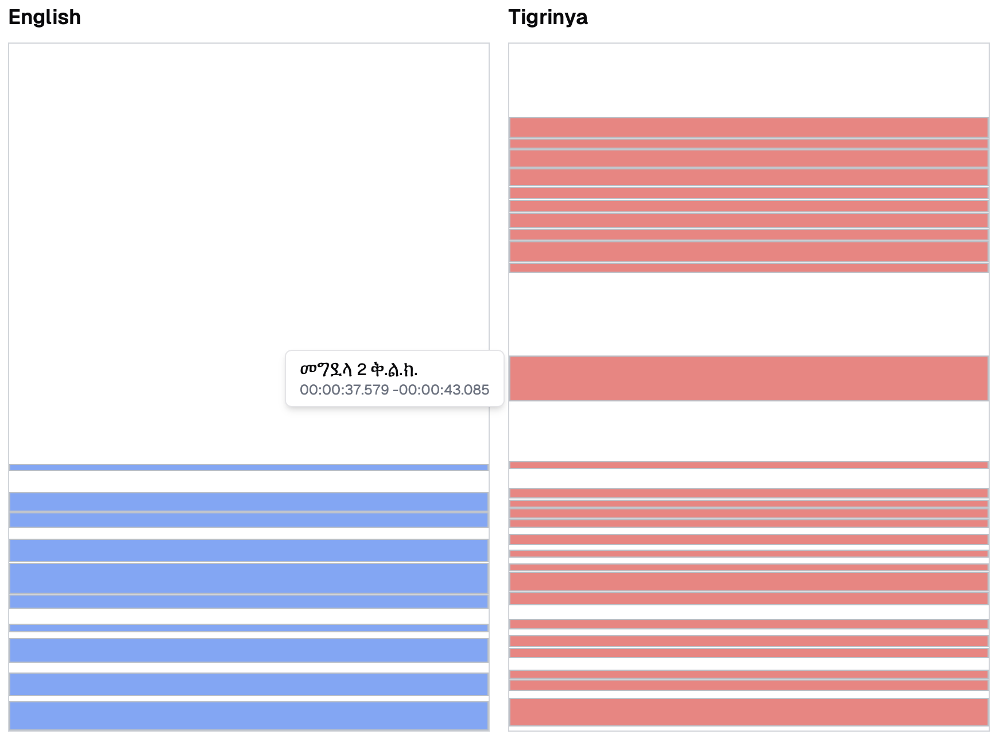

# Subtitle Importer Test Data

This directory contains test files from The Chosen Episode 1 in English and Tigrinya:

-   `TheChosen_101_en.vtt` - Original English subtitles
-   `TheChosen_101_TIgrinya.vtt` - Tigrinya subtitles
-   `TheChosen_101_en.source` - English VTT transformed to Codex format
-   `TheChosen_101_en.codex` - Reference file with merged English and Tigrinya

Key differences between English and Tigrinya subtitles:

1. Tigrinya has additional subtitles for on-screen text
2. Complex subtitle mappings (1:1, 1:many, many:1, many:many)
3. Timing offsets between corresponding subtitles

The importer algorithm merges Tigrinya into English based on timestamp overlap matching:

[Interactive view (no guarantee of maintaining this view)](https://v0-french-and-english-subtitles.vercel.app)

## Testing Changes

To verify importer changes:

1. Run modified importer on test files
2. Compare output against reference `.codex` file
3. Verify cell IDs, Tigrinya content, and timing alignments match exactly

Mismatches will cause compile errors.
